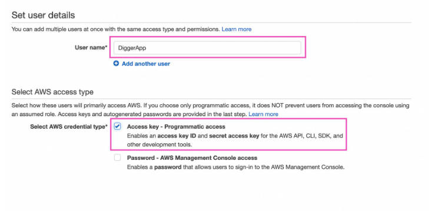

- [PURPOSE](#purpose)
  - [ISO 27001](#iso-27001)
  - [GPDR](#gpdr)
- [DISCLAIMER](#disclaimer)
- [IN CASE OF SECURITY PROBLEMS](#in-case-of-security-problems)
  - [CONTACT INFORMATION OF YOUR COMPANY](#contact-information-of-your-company)
- [AUTHENTIFICATION](#authentification)
  - [MFA - MULTI-FACTOR AUTHENTICATION](#mfa---multi-factor-authentication)
    - [MFA FOR ALL CONSOLE USERS](#mfa-for-all-console-users)
    - [MFA - ROOT ACCOUNT](#mfa---root-account)
    - [LOGIN ALERTS](#login-alerts)
    - [DETERMINE THE TYPE OF ACCESS PER USER](#determine-the-type-of-access-per-user)
- [ACCOUNT MANAGEMENT](#account-management)
  - [DELETE/DEACTIVATE ACCOUNTS THAT HAVE BEEN INACTIVE FOR X DAYS](#deletedeactivate-accounts-that-have-been-inactive-for-x-days)
  - [PASSWORD AND ACCESS KEY POLICY](#password-and-access-key-policy)
  - [DO NOT ENABLE FULL RIGHTS](#do-not-enable-full-rights)
    - [CREATE A ROLE FOR INCIDENT MANAGEMENT](#create-a-role-for-incident-management)
- [DATABASE](#database)
  - [AUTO UPDATE MINOR - INSTANCE RDS](#auto-update-minor---instance-rds)
  - [PUBLIC AVAILABILITY](#public-availability)
- [ENCRYPTION](#encryption)
  - [RDS (DATABASES)](#rds-databases)
  - [EFS (SERVERLESS FILE STORAGE)](#efs-serverless-file-storage)
  - [EBS (BLOCK STORAGE)](#ebs-block-storage)
- [LOGS - AWS CloudTrail](#logs---aws-cloudtrail)
- [GO FURTHER](#go-further)

# PURPOSE
The purpose of this article is to help you set up the rules to deploy in your AWS infrastructure.
Les règles ont pour objectif :
* Make your infrastructure more secure than default,
* Make you ISO 27001 compliant,
* Make you GDPR compliant,
* Do not have too much impact on the production of your teams.

## ISO 27001
ISO 27001 has become a global benchmark for information security and is used by many organizations to assess and improve their information security. It can also be used as a means to demonstrate compliance with specific security requirements, such as government regulations or customer requirements.

_Be aware that just because a company is ISO 27001 certified does not mean it is implementing appropriate security measures._

## GPDR
The GDPR (General Data Protection Regulation) is a European regulation that aims to strengthen the protection of personal data of European Union citizens.

The role of the GDPR is to give individuals greater control over their personal data, as well as greater visibility into how that data is collected, stored, used and shared by organizations. The regulation also requires organizations to put in place appropriate technical and organizational security measures to protect personal data from loss, theft or unauthorized use.

# DISCLAIMER
The queries are provided as an indication, I recommend you to test them and modify them if necessary.

# IN CASE OF SECURITY PROBLEMS
The following sections deal with safety issues not related to the above mentioned standards.
## CONTACT INFORMATION OF YOUR COMPANY
AWS account uses this contact information to contact you in the event of suspicious activity by their teams.

In order to do it right:
* This address must be generic (ideally the address of your SOC team so that an AWS alert generates an alert from your security team),
* The phone must be an always-on line (with an always-assigned staff) such as an on-call line or a switchboard.

To configure this information follow this [documentation from AWS](https://docs.aws.amazon.com/awsaccountbilling/latest/aboutv2/manage-account-payment.html).

# AUTHENTIFICATION
## MFA - MULTI-FACTOR AUTHENTICATION
MFA is an authentication method that requires two different authentication factors to access an account or system. Commonly used authentication factors are a password and a code generated by an MFA app on a mobile device.

By enabling MFA functionality on AWS accounts, you greatly increase the security of your accounts, as the attacker would also need physical access to the MFA device associated with the account to log in. This greatly reduces the risk of password theft and account compromise.
### MFA FOR ALL CONSOLE USERS
If you don't configure MFA on accounts with access to the AWS console, the accounts may be vulnerable to phishing or password theft attacks.

If attackers are able to obtain login credentials, they can gain access to the AWS console, where they can edit or delete data, launch instances, open ports, etc.

### MFA - ROOT ACCOUNT
The root account is the primary administrative account on AWS, which has full access to all services and resources in the environment. 

If the root account is compromised, it can lead to catastrophic consequences, including loss of sensitive data, configuration changes, service downtime, etc.

### LOGIN ALERTS
Make sure you get an alert every time an account that is not using MFA logs in.
Make sure you get an alert every time the root account logs in.

Documentations : 
* https://www.intelligentdiscovery.io/controls/cloudwatch/cloudwatch-alarm-no-mfa
* https://aws.amazon.com/fr/blogs/security/how-to-receive-notifications-when-your-aws-accounts-root-access-keys-are-used/
* https://aws.amazon.com/fr/blogs/mt/monitor-and-notify-on-aws-account-root-user-activity/

### DETERMINE THE TYPE OF ACCESS PER USER
By default, no checkbox is selected in the AWS console when creating a new IAM user. 
When certifying the IAM user's credentials, you must determine the type of access the user needs.



* Programmatic access: the user may need to make API calls, use the AWS CLI, or use the Windows PowerShell tools.
* AWS Management Console Access: the user needs to access the AWS Management Console.

Documentation : 
* https://learn.digger.dev/misc/aws-keys.html

# ACCOUNT MANAGEMENT
## DELETE/DEACTIVATE ACCOUNTS THAT HAVE BEEN INACTIVE FOR X DAYS
Difficult to set up in the case of a digital service company (and still...) it is necessary to ensure that the accounts present are used and usable periodically.

If an account has not been active for several weeks/months, it is necessary to ask yourself a few questions: 
* Does the user still need this account?
* Does the user still know how to connect?
* Has the user already logged in? If not, see the previous questions.

Requête AWS : 
```
aws iam list-users --output table
```

## PASSWORD AND ACCESS KEY POLICY
As for all infrastructures, it is important to define a password management policy.

As the risks and probability of exploitation are not the same as for your internal networks, it is possible that it is dedicated to your cloud infrastructure.

Remember: 
* Lengths (max and min) of passwords,
* Complexity,
* Reusability,
* Lifetime (max and min),

## DO NOT ENABLE FULL RIGHTS
As always, it is recommended to follow the principle of least privilege, i.e. provide only the strictly necessary rights to your users.

Providing too many rights, in this case maximum rights, is the best way to put your infrastructure at risk.

Requête AWS : 
```
aws iam list-policies --query 'Policies[?PolicyId!=`{managed-policies-arn}`].{PolicyName:PolicyName,PolicyArn:Arn}' --output json | jq -r '.[] | select(.PolicyName != "AdministratorAccess") | [.PolicyArn, .PolicyName] | @tsv' | while IFS=$'\t' read -r POLICY_ARN POLICY_NAME; do aws iam get-policy-version --policy-arn "$POLICY_ARN" --version-id $(aws iam list-policy-versions --policy-arn "$POLICY_ARN" --query 'Versions[?IsDefaultVersion==`false`]|[0].VersionId' --output text) --query 'PolicyVersion.Document' | jq -r '.Statement[] | select(.Effect == "Allow" and .Action == ["*"] and .Resource == ["*"]) | .PolicyVersion.PolicyName' | while read -r POLICY_STATEMENT_NAME; do echo "$POLICY_ARN,$POLICY_NAME,$POLICY_STATEMENT_NAME"; done; done
```

### CREATE A ROLE FOR INCIDENT MANAGEMENT
The cloud inherits the heresies already found in on-premise infrastructures.
Here we have the famous "I put the domain administrator account so he can change the password".

This is why it is important to create a role to allow users to manage incidents with AWS Support.

Documentation : 
* https://gsl.dome9.com/D9.AWS.IAM.25.html 

# DATABASE
## AUTO UPDATE MINOR - INSTANCE RDS
Amazon Relational Database Service (Amazon RDS) is a set of managed services that makes it easy to configure, use, and scale databases in the cloud.

A minor engine release is an update to the database engine version within a major engine release. For example, a major engine version might be numbered 9.6 and minor versions might be numbered 9.6.11 and 9.6.12.

It is possible to activate the 'Auto Minor Version upgrade' indicator in order to automatically receive minor updates of the DBMS engine. Here are the two prerequisites: 
* The database is running a minor version of the engine lower than the preferred version.
* The database is running a minor version of the engine that is lower than the preferred version. * The automatic upgrade of minor versions is enabled for the database.

_It is possible to do the same thing for the major version, however this manipulation can be dangerous within a production infrastructure._

Documentation : 
* https://docs.aws.amazon.com/fr_fr/AmazonRDS/latest/UserGuide/USER_UpgradeDBInstance.Upgrading.html

## PUBLIC AVAILABILITY
It hurts to say it but make sure your RDS databases are not accessible to everyone (disable "database Publicly Accessible" and update your VPC groups).

Requêtes : 
* Lister les groupes de sécurité avec des instances RDS : 
```
aws rds describe-db-instances --db-instance-identifier your-db-instance-name --query "DBInstances[*].VpcSecurityGroups[*].VpcSecurityGroupId" --output text
```

* Supprimer la règle d'accès : 
```
aws ec2 revoke-security-group-ingress --group-id your-security-group-id --protocol tcp --port 3306 --cidr 0.0.0.0/0
```
* Vérifier : 
```
aws ec2 describe-security-groups --group-ids your-security-group-id --query "SecurityGroups[*].IpPermissions[*].IpRanges[*].CidrIp" --output text
```

_In general, check if other administration ports are open to the four winds._

# ENCRYPTION
## RDS (DATABASES)
DBs often store important data (both legally and for your business), so it's important to ensure that each instance is encrypted.

When RDS encryption is enabled, data stored on the instance's underlying storage, automated backups, read replicas and snapshots are all encrypted.

This option is only available at the launch of the BDD instance, not after.

Requête : 
```
aws rds describe-db-instances --db-instance-identifier mydb --query "*[].{StorageEncrypted:StorageEncrypted}" --output text
```

Documentation : 
* https://docs.aws.amazon.com/AmazonRDS/latest/UserGuide/Overview.Encryption.html

## EFS (SERVERLESS FILE STORAGE)
Amazon Elastic File System (EFS) automatically grows and shrinks as you add and remove files, without the need to manage or allocate them.

One solution is to mount the new EFS (with encryption) next to the old (unencrypted) one and use the rsync command to copy the data.

As with DB encryption, if the EFS was created without this option enabled, you need to create EFS with the correct configuration and transfer the data from the old to the new.

Requêtes : 
* Créer la clef : 
```
aws kms create-key
```
* Configurer l'EFS pour utiliser cette clef : 
```
aws efs put-encryption-config --file-system-id <filesystem-id> --encryption-config "{\"Encrypted\":true,\"KmsKeyId\":\"<kms-key-arn>\"}"
```
* Contrôler : 
```
aws efs describe-file-systems --file-system-id <filesystem-id> --query 'FileSystems[*].Encrypted'
```

Documentation : 
* https://docs.aws.amazon.com/fr_fr/efs/latest/ug/encryption.html

## EBS (BLOCK STORAGE)
Amazon Elastic Block Store (Amazon EBS) is an easy-to-use, scalable, high-performance block storage service designed for Amazon Elastic Compute Cloud (Amazon EC2).

As with the previous two parts, it is very strongly recommended to enable encryption on EBS volumes.

Requête : 
```
aws --region <region> ec2 enable-ebs-encryption-by-default
```

Documentation : 
* https://docs.aws.amazon.com/fr_fr/AWSEC2/latest/UserGuide/EBSEncryption.html

# LOGS - AWS CloudTrail
CloudTrail and AWS IAM must be enabled on all regions.

CloudTrail is an AWS service that helps you with operational and risk auditing, governance, and compliance of your AWS account. Actions performed by an AWS user, role or service are logged as events in CloudTrail. 

AWS IAM Access Analyzer:
 * helps identify your organization's resources and accounts that are shared with an external entity.
* Validates IAM policies against policy grammar and best practices.
* Generates IAM policies based on access activity in your AWS CloudTrail logs.

Requêtes : 
* Check it: 
```
aws accessanalyzer list-analyzers --region <region-name>
```

* Activate it : 
```
aws accessanalyzer enable-analyzer --analyzer-name "default" --type ACCOUNT --region <region-name>
``` 

_It is important to take into account that this action will increase the bill. So beware._

Documentations : 
* https://docs.aws.amazon.com/IAM/latest/UserGuide/what-is-access-analyzer.html
* https://docs.aws.amazon.com/fr_fr/awscloudtrail/latest/userguide/cloudtrail-user-guide.html

# GO FURTHER
Don't hesitate to implement audits from CIS repositories (level 1 and 2) on your AWS infrastructure: https://docs.aws.amazon.com/securityhub/latest/userguide/cis-aws-foundations-benchmark.html